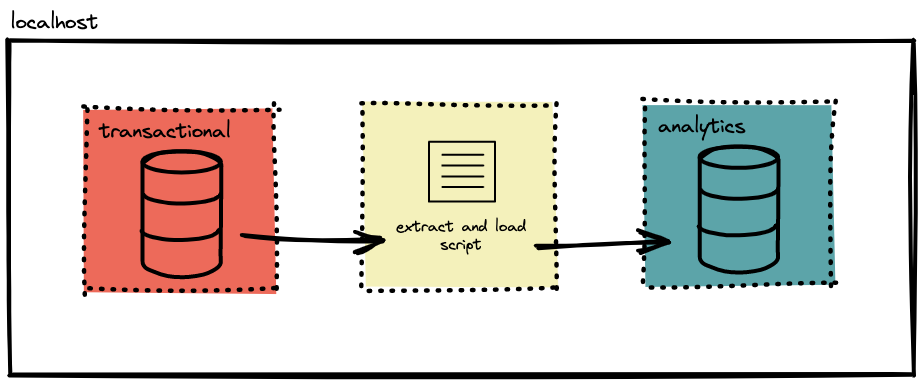

# Desafio de engenharia de dados da Refera!
O objetivo do desafio na minha visão, foi concluído com sucesso, utilizando um script `Python` e suas respectivas bilbiotecas `Pandas` e `SQLAlchemy`, foram suficientes para realizar a cópia e a carga de dados para o bd de destino `analytics`.

# Dificuldades
O desafio proposto, de certa forma, não apresenta um nível de complexidade grande, mas, como todo desafio existem impasses durante seu desenvolvimento. Meu principal empecilho do desafio foi, desenvolver um script em python que fornecesse o `CREATE TABLE` das tabelas do bd `transactional`, ao longo de muitas pesquisas encontrei prováveis soluções para tal objetivo. Analisando as possíveis soluções, decidi optar por utilizar uma query `.SQL` que cria as tabelas no bd `analytics`, essa query é encontrada na pasta `/data`.

# Instruções de como executar o projeto
- Clonar o repositório `https://github.com/Filipecdj/Desafio_Refera.git`
- Executar o docker-compose
- O script python irá rodar dentro o docker

Após isso, os dados serão ingeridos no bd `analytics`.

# Comentário
Gostaria de agradecer a oportunidade para a resolução do desafio proposto, obrigado :D